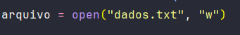
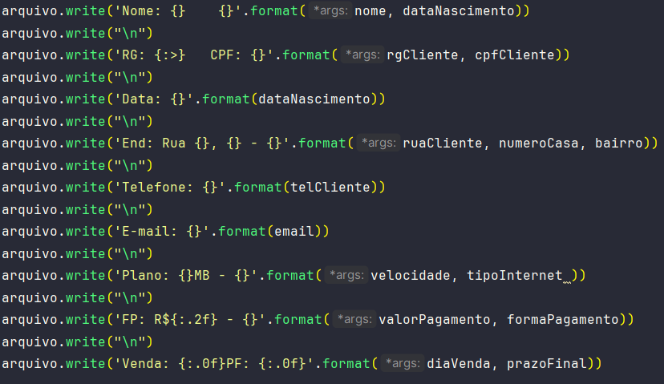

# Projeto  de  Cadastro  de  Clientes 

O Projeto de Cadastro de Clientes é uma aplicação Python que permite o registro eficiente de informações dos clientes para serviços de internet. A seguir, você encontrará uma documentação detalhada sobre o projeto, incluindo instruções de uso, detalhes de implementação e considerações importantes.

## Tecnologia

</img> 

## Ferramenta de Desenvolvimento 

</img>

## Pré-requisitos
Antes de executar o código, certifique-se de ter o módulo notes instalado. Caso não o tenha, você pode instalá-lo usando:

```bash
pip install notes
```

## Como usar

- Execute o script 'cadastro_cliente.py' usando o seguinte comando no terminal:

```bash
python cadastro_cliente.py
```
- Forneça as informações solicitadas para cada cliente.
- O arquivo "dados.txt" será gerado automaticamente, contendo todas as informações fornecidas.

## Exemplo de uso
Suponha que você queira cadastrar um novo cliente chamado João Silva. Você pode seguir as instruções do programa, inserir os dados solicitados e verificar o arquivo "dados.txt" para os resultados.

## Estrutura do Código

O código está organizado em seções distintas para facilitar a leitura e manutenção. 

### Importando a biblioteca 'notes'

```python
import notes 
```
### Entrada de dados do usuário


### Condição de entrada 


### Abertura do arquivo .txt


<br>

### Apresenta os dados do cliente no arquivo


<br>

### Fechando o arquivo .txt


<br>


## Melhorias Futuras

Para melhorar ainda mais este projeto, considere adicionar:

- Tratamento de erros para entradas inválidas.
- Suporte a diferentes formas de armazenamento de dados (por exemplo, banco de dados).

Sinta-se à vontade para contribuir, fazer melhorias e adaptar o código conforme necessário para atender aos requisitos específicos do seu projeto. Envie um pull request para o repositório do GitHub. 

## Instalação
```bash
https://github.com/BrunoviskFe/CadastroCliente.git
```